<p align="center">
  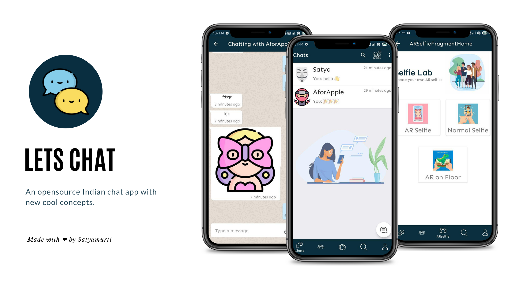
</p>

# LetsChat
[](LICENSE)
[](https://github.com/satyamurti/LetsChat/issues)


  **An opensource Indian chat app** 🇮🇳 with new cool concepts.
  
  
[](https://satyamurti.github.io)


### 💡 Introduction

<p align="center">
  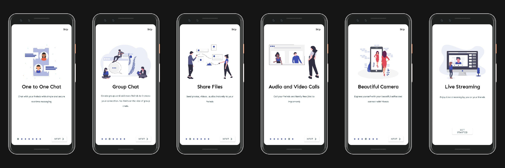
</p>

As we all know, the Covid19 pandemic changes the way of education, making everything online as soon as possible. Nowadays, chat apps are evolving. Today, I am introducing you to my new app, "Let's Chat" this will totally change the game by giving students a platform to interact and collaborate. This app will provide access free to all users for all its features. Through this app, students can message each other, study together, and learn a new way to share notes and stuff. But how is this possible? I am providing these significant features.

#### Chat Messenging 
- This feature allows WhatsApp like Messenging where users can create groups and have private chats to interact with each other, asking doubts by sending images, videos, and audio files, etc.( this will also help students to take breaks )
#### Group Meetings
- Group Meetings allows users to interact with each other and share files and documents while interacting virtually. Here teachers can conduct doubt sessions, Viva, online meetings smoothly.
#### Go Live
 - This will help all the schools and colleges to interact with students and take live online lectures. In this, they can share direct assignments, files, documents, pdf, etc., making the conversation more interactive.
#### Library Section 
 - This holds tons of online pdf books. Read, Gain a ton of knowledge. Teachers can create personal libraries where students can access all materials with a secret key provided by teachers.
#### AR Camera
- Augmented Reality is changing the way of living. This feature will help students by providing a live simulation of educational concepts. Students can also send beautiful filters applied on their face :) to each other (This will increase the quality of interaction and make people feel interactive)

This app will help all the students interact live while studying and for people in the corporate sector for meetings, etc. My goal is to provide the user with overall access in a single packed app Rather than installing different-different apps for various purposes. Without getting lost while scrolling on Instagram, etc. here, users can manage both Social and Education more efficiently. So that's it. This is my final delta project.
Thank you 😊. Have a Great Day.


### 📸 Screenshots

||||
|:----------------------------------------:|:-----------------------------------------:|:-----------------------------------------: |
| 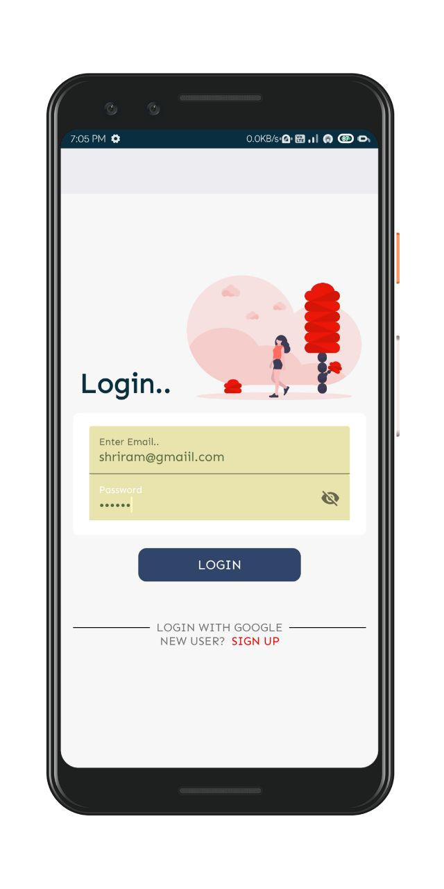 | 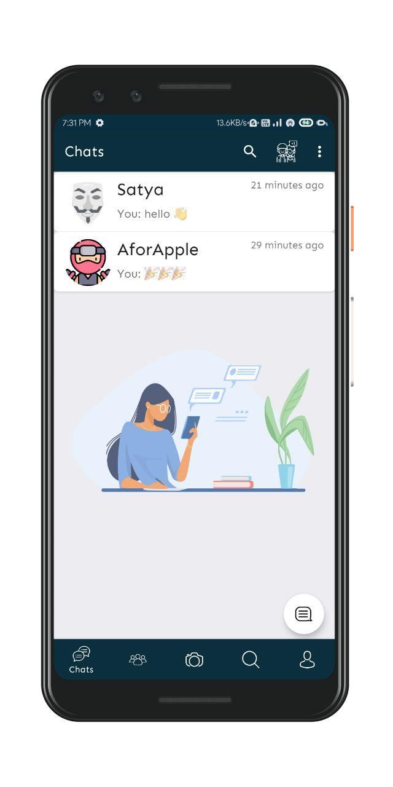 | 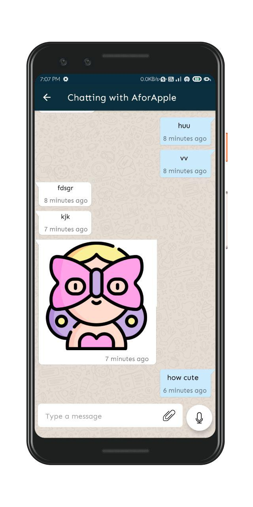 |
| 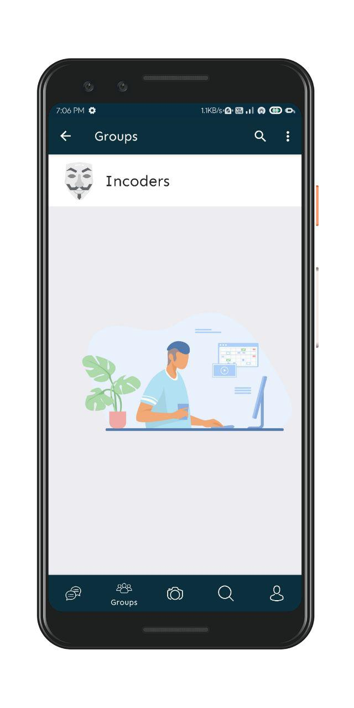 | 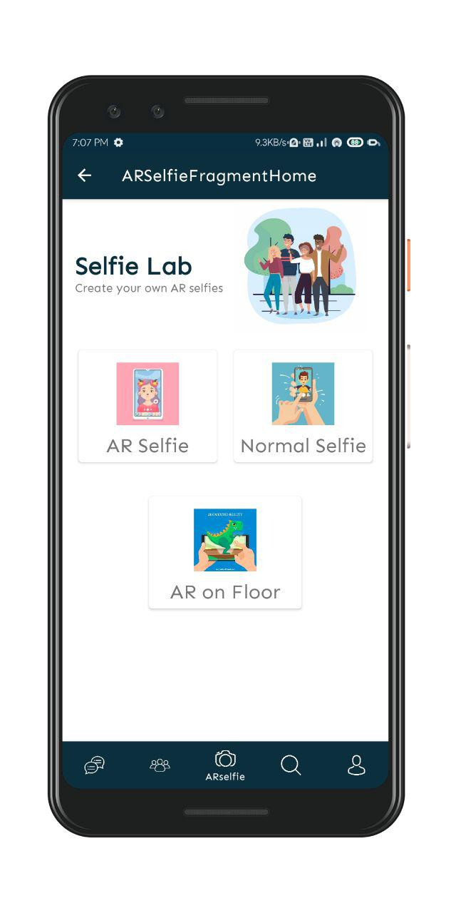 | 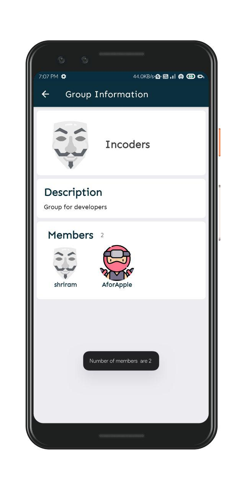 |
| 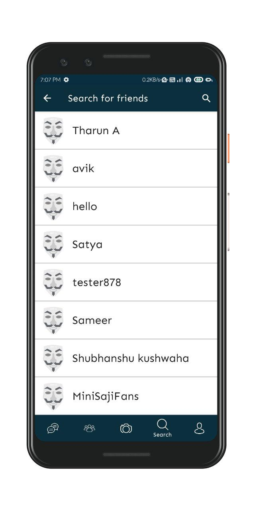 | 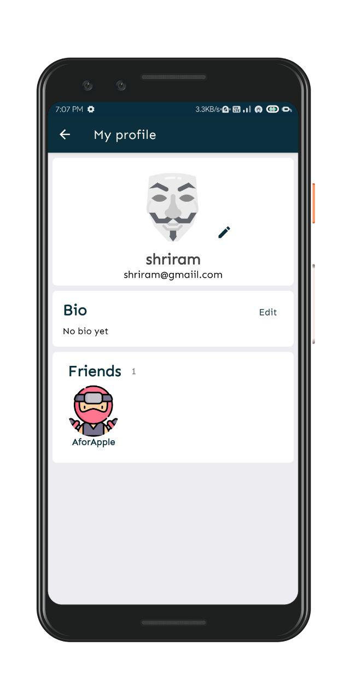 | 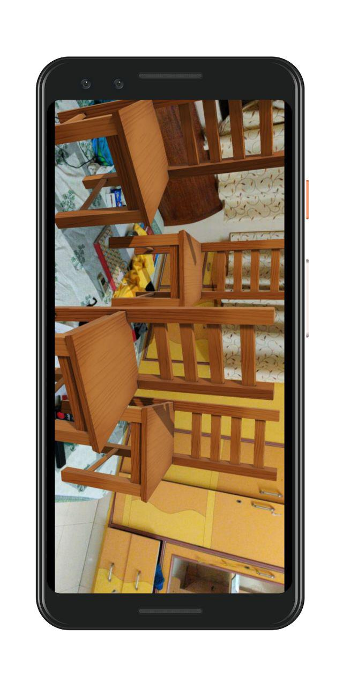 |

### 📌 Features
- [x] Authentication using Firebase Auth
- [x] One to One Chats
- [x] Group Chats
- [x] Text messages
- [x] Audio, Video and Document Messages
- [x] Selfie Camera
- [x] Augmented Reality Filters in camera
- [x] User Mentions
- [x] Emojis Support
- [x] Edit Profile 
- [x] Search People
- [x] Online/Last Active Status
- [x] Push Notifications
### ⚙️ Future Plans
Here's a list of features that I have planned to include overtime.
- [ ] Custom Stickers
- [ ] Video and Audio Calls
- [ ] Live Streaming
- [ ] Library Section (Similar to Google Classroom)
- [ ] Phone Number Authentication
- [ ] GIF Messages
- [ ] Location Messages
- [ ] Link/URL Preview Messages
- [ ] Reply Messages
- [ ] Message Read/Receipt Ticks
- [ ] Unread Messages Count
- [ ] Typing Indicator
- [ ] Chat / Group Media, Documents, and Links
- [ ] Restore/Export from and to CSV File
- [ ] Chat Heads
- [ ] Block/Unblock Users

### Built With 🛠
* [Kotlin](https://kotlinlang.org/)
* [MVVM](https://developer.android.com/jetpack/docs/guide)
* [Coroutines](https://kotlinlang.org/docs/reference/coroutines-overview.html) - Asynchronous programming 
* [Data Binding](https://developer.android.com/topic/libraries/data-binding/) - Declaratively bind observable data to UI elements.
* [Lifecycles](https://developer.android.com/topic/libraries/architecture/lifecycle) - Create a UI that automatically responds to lifecycle events.
* [LiveData](https://developer.android.com/topic/libraries/architecture/livedata) - Build data objects that notify views when the underlying database changes.
* [Navigation](https://developer.android.com/guide/navigation/) - Handle everything needed for in-app navigation.
* [ViewModel](https://developer.android.com/topic/libraries/architecture/viewmodel) - Store UI-related data that isn't destroyed on app rotations. Easily schedule asynchronous tasks.
* [Firebase](https://firebase.google.com/docs) - Tools to develop high-quality apps.
  - [Authentication](https://firebase.google.com/docs) - Allows an app to securely save user data in the cloud.
  - [Cloud Firestore](https://firebase.google.com/docs/firestore) - Flexible, scalable NoSQL cloud database to store and sync data.
  - [Cloud Functions](https://firebase.google.com/docs/functions) - Automatically run backend code in response to events triggered by Firebase 
  - [Cloud Messaging](https://firebase.google.com/docs/cloud-messaging) - Notify a client app.
  - [Cloud Storage](https://firebase.google.com/docs/storage) - Store and serve user-generated content.
* [Glide](https://github.com/bumptech/glide) - Load and cache images by URL.
* [Retrofit 2](https://github.com/square/retrofit) - Handle REST api communication.

### Architecture
This app uses [***MVVM (Model View View-Model)***](https://developer.android.com/jetpack/docs/guide#recommended-app-arch) architecture.


### 🤝 Contribute
Awesome! If you would like to contribute with above features or submit a bugfix, you're always welcome !
See [Contributing Guidelines](CONTRIBUTING.md). 

### ⚡ Getting Started
* Clone or download repository as a zip file.
* Open project in Android Studio.
* Create Firebase project.
* Paste google-services.json file in app/ folder
* In Firebase console enable all Firebase services listed in section Features.
* Finally run the app `SHIFT+F10`.

### ✉️ Contact
If you need any help, you can connect with me.

Visit:- [satyamurti.github.io](https://satyamurti.github.io)
### 📃 License
```
MIT License

Copyright (c) 2020 Satyamurti Doddini

Permission is hereby granted, free of charge, to any person obtaining a copy
of this software and associated documentation files (the "Software"), to deal
in the Software without restriction, including without limitation the rights
to use, copy, modify, merge, publish, distribute, sublicense, and/or sell
copies of the Software, and to permit persons to whom the Software is
furnished to do so, subject to the following conditions:

The above copyright notice and this permission notice shall be included in all
copies or substantial portions of the Software.

THE SOFTWARE IS PROVIDED "AS IS", WITHOUT WARRANTY OF ANY KIND, EXPRESS OR
IMPLIED, INCLUDING BUT NOT LIMITED TO THE WARRANTIES OF MERCHANTABILITY,
FITNESS FOR A PARTICULAR PURPOSE AND NONINFRINGEMENT. IN NO EVENT SHALL THE
AUTHORS OR COPYRIGHT HOLDERS BE LIABLE FOR ANY CLAIM, DAMAGES OR OTHER
LIABILITY, WHETHER IN AN ACTION OF CONTRACT, TORT OR OTHERWISE, ARISING FROM,
OUT OF OR IN CONNECTION WITH THE SOFTWARE OR THE USE OR OTHER DEALINGS IN THE
SOFTWARE.
```
